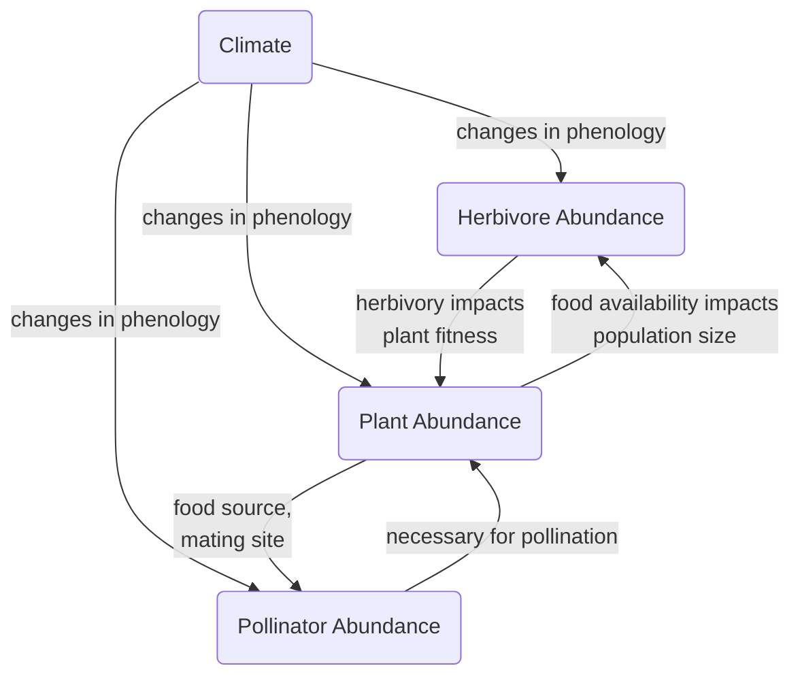

# Homework 4 - Typora

## Header 2

* wow 
* an
* unordered
* list

### Header 3

1. this
2. is
3. an 
4. ordered
5. list

#### Header 4

this is how  
you do  
a manual  
line  
break  

##### Header 5

Wow and this is a [link](https://gotellilab.github.io/Bio381/Homeworks/Homework04_S2021.html)


###### Header 6

> and this is a block quote

```
plain code block
```

```{r}
x <- 8
y <- 64
x + y
```
What if I just want one `word` here?

And here is some math $a^2 + b^2 = c^2$

And more math,
$$
a^2 + b^2 = c^2
$$
but on its own.

___


| This | is   | a    | table |
| ---- | ---- | ---- | ----- |
| 1    | a    | z    | 4     |
| 2    | b    | y    | 5     |
| 3    | c    | x    | 6     |


==Highlight me== 

But not me


!(flowchart drawing [https://github.com/kbardsley/BardsleyBio381/blob/main/Homework/flowchart_drawing.JPG?raw=true]




